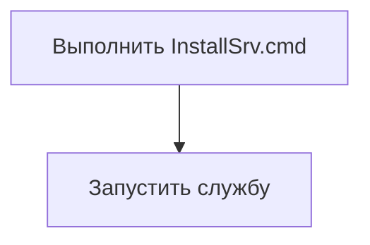

# Testing_job
Тестовое
Необходимо с текущей даты загружать курсы валют: доллар США (код **840**), российский рубль (код **643**), евро (код **978**) с сайта НБ РБ (реализовать в виде службы Windows двумя разными способами: используя формат XML и через API). Курсы сохранять в текстовые файлы в две отдельные папки, т.е. вариант загрузки через XML сохранять в один каталог, а через API в другой. Предусмотреть возможность менять каталоги для сохранения файлов (можно использовать конфигурационный файл службы *.ini).  Файлы должны создаваться в каталоге каждый день, имя файла должно содержать текущую дату. Пример содержания файла приведен ниже.  
Исходные файлы проекта, по возможности, залить на гит и написать краткую инструкцию по установке готовой службы на ПК.  

--- 

# 1. После установки службу надо запустить.



# 2. Файлы
1. ServiceProject.exe - исполняемый файл со службой
2. deleteSrv.cmd - удаление службы
3. installSrv.cmd - установка службы 
4. uninstallSrv.cmd - деинсталляция службы 
5. Settings.ini - файл настроек путей, по которым будут записываться файлы курсов валют.
6. Logger.log - журнал работы сервиса.

--- 
Как только служба запустится, она проверит наличие файла Setting.ini. Если данного файла нет, она создаст его и заполнит значениями по умолчанию.

```cmd
[XML]
folderPath=D:\Temp\XML
[JSON]
folderPath=D:\Temp\JSON
```

Все нужные папки на старте службы тоже проверяются. Если чего-то не хватает - все будет создано.

--- 
Запущенная служба создаст отдельный поток. 
В этом потоке решаются все вопросы с получением курсов валют.
Если полученные файлы с курсами удалить, то примерно через 4 минуты они будут сформированы вновь.

Если файлы уже сформированы на текущую дату, они не будут обновляться. 
На следующие сутки сформируются новые файлы.

--- 

Большая часть из происходящего внутри сервиса и потока логируется в файл **Logger.log**.

Проект собирался на **Delphi 10.3**. В проекте используются методы классов `TFile` и `TDirectory` - проект в Delphi XE из-за этого не соберется, так как данные классы появились в версии, начиная с Delphi XE2.
